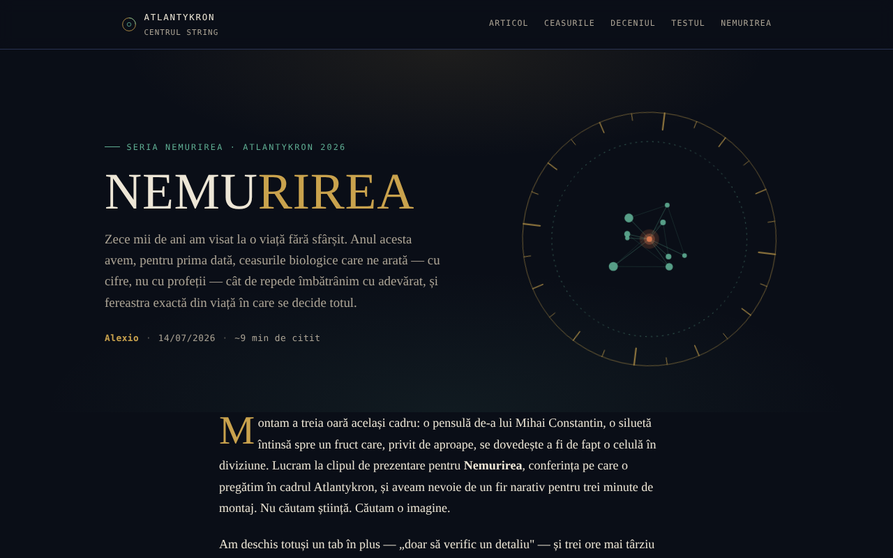

# NEMURIREA — Vârsta care ne scrie destinul biologic

Eseu interactiv despre ceasurile biologice și știința longevității, în seria Nemurirea, Atlantykron 2026.

**Live:** https://chiuta.github.io/Nemurirea/

## Ce este

NEMURIREA este o pagină-eseu dintr-un singur fișier HTML, semnată Alexio, datată 14/07/2026 (aproximativ 9 minute de citit). Pornește de la interviul realizat de Elena Oceanu cu prof. dr. Alberto Beretta, publicat în SmartLiving.ro, și de la datele prezentate la Milan Longevity Summit 2026; textul declară că ideile științifice aparțin lui Beretta și cercetătorilor citați, iar interpretarea și structura aparțin autorului eseului. Eseul are scop informativ și educațional și nu constituie sfat medical (precizare din aplicație).

## Funcții

- Eseu în secțiuni: „Visul vechi de zece mii de ani" (cronologie de la Ghilgameș la criogenie), „Ceasurile adevărate" (ceasul epigenetic, GlycanAge, ceasurile proteomice), „Trei descoperiri de la Milan Longevity Summit 2026", „Deceniul decisiv", „Cum deosebești știința de marketing", „Testează-ți instinctul științific", „Nemurirea adevărată", „Surse și lecturi".
- Navigare în antet: Articol, Ceasurile, Deceniul, Testul, Nemurirea.
- Test de instinct științific cu întrebări cu variante multiple („Următoarea întrebare", „Ia testul de la capăt"), cu o notă explicativă după fiecare răspuns.
- Buton „↑" de întoarcere la începutul paginii; elementele apar progresiv la derulare.
- Imagine de previzualizare socială (`nemurirea-og.png`) pentru partajare.

## Manual de utilizare

1. Citește eseul derulând pagina sau folosește linkurile din antet (Articol, Ceasurile, Deceniul, Testul, Nemurirea).
2. În secțiunea „Testează-ți instinctul științific" alege un răspuns pentru fiecare întrebare; apare nota explicativă.
3. Apasă „Următoarea întrebare" pentru a continua; la final apasă „Ia testul de la capăt" pentru a relua.
4. Secțiunea „Surse și lecturi" conține linkurile către sursele citate (SmartLiving.ro, Milan Longevity Summit, SoLongevity, Nobel Prize, arXiv, GlycanAge).
5. Butonul „↑" te readuce sus.

## Confidențialitate și rețea

- Local: nu am găsit utilizare de `localStorage`, `sessionStorage` sau IndexedDB; rezultatul testului nu se salvează.
- Rețea: nu am găsit apeluri `fetch`, scripturi sau fonturi externe; pagina se încarcă dintr-un singur fișier (plus imaginea `nemurirea-og.png`, folosită doar ca previzualizare socială).
- Linkurile externe (smartliving.ro, milanlongevitysummit.org, solongevity.com, nobelprize.org, arxiv.org, glycanage.com, centrulstring.ro, Patreon) se deschid doar dacă le apeși. Subsolul declară „Fișier unic, offline, fără telemetrie".

## Rulare locală / offline

Descarcă `index.html` și deschide-l în browser; eseul și testul funcționează fără internet. Linkurile din „Surse și lecturi" necesită internet.

## Licență

Licența nu este încă declarată explicit în acest repository; vezi nota din aplicație. Subsolul aplicației indică: „© 2026 Centrul STRING · Text și montaj: Alexio".

## Autor

Alexio — Alexandru-Ionuț Chiuță, contact: alexio@trom.tf. Aplicația menționează Centrul STRING (CSPCF) ca editor al seriei Nemurirea în cadrul Atlantykron 2026.

## English summary

NEMURIREA is a single-file Romanian-language essay on biological aging clocks and longevity science (part of the Nemurirea series, Atlantykron 2026), with a short multiple-choice quiz. Based on an interview with Prof. Alberto Beretta and Milan Longevity Summit 2026 data. No browser storage and no external requests were found; it is informational, not medical advice.
